# IEEE PHM Data Challenge 2014

This repository contains the IEEE PHM Data Challenge 2014 fuel-cell durability dataset and a reproducible analysis workflow for quick exploration and visualization.

## Repository Structure

```text
data/     Original dataset files. Do not modify these files.
code/     Reproducible Python analysis scripts.
results/  Generated summaries and figures.
```

## Dataset

- **FC1**: fuel-cell durability test operated in a stationary regime
- **FC2**: fuel-cell durability test operated under dynamic current
- **Source**: https://search-data.ubfc.fr/FR-18008901306731-2021-07-19_IEEE-PHM-Data-Challenge-2014.html#pub_col_ver

The dataset includes ageing, polarization, and electrochemical impedance spectroscopy (EIS) measurements.

## Quick Analysis

Run the analysis script from the repository root:

```bash
python code/main.py
```

The script reads the Excel/CSV files under `data/` and writes figures plus summary tables to `results/`.

## Key Results

| Fuel Cell | Duration (h) | Initial Utot (V) | Final Utot (V) | Voltage Drop (V) | Degradation Rate (mV/h) |
| --- | ---: | ---: | ---: | ---: | ---: |
| FC1 | 1154.2 | 3.317 | 3.211 | -0.106 | -0.092 |
| FC2 | 1020.5 | 3.325 | 3.084 | -0.241 | -0.236 |

FC2 shows a larger voltage loss and a faster degradation rate than FC1, consistent with the stronger stress expected from dynamic-current operation.

## Summary Table

| Fuel Cell | Start Time (h) | End Time (h) | Duration (h) | Initial Utot (V) | Final Utot (V) | Voltage Drop (V) | Degradation Rate (mV/h) | Mean Current (A) | Mean Air Inlet Temp (C) |
| --- | --- | --- | --- | --- | --- | --- | --- | --- | --- |
| FC1 | 0.0 | 1154.2134 | 1154.2134 | 3.317 | 3.211 | -0.106 | -0.0918 | 70.2568 | 42.2916 |
| FC2 | 0.0 | 1020.5363 | 1020.5363 | 3.325 | 3.084 | -0.241 | -0.2362 | 69.9381 | 44.9914 |

## Figures

- `figures/ageing_voltage_degradation.png`: stack voltage and cell imbalance during ageing
- `figures/ageing_channels/`: individual ageing plots for every numeric channel
- `figures/polarization/`: individual polarization plots using scatter points with dashed guide lines
- `figures/eis/`: individual EIS Nyquist plots using raw impedance data

### Ageing Voltage Degradation


## Ageing Parameter Notes

| Parameter | Meaning |
| --- | --- |
| U1 (V) | Voltage of cell 1. |
| U2 (V) | Voltage of cell 2. |
| U3 (V) | Voltage of cell 3. |
| U4 (V) | Voltage of cell 4. |
| U5 (V) | Voltage of cell 5. |
| Utot (V) | Total stack voltage. |
| J (A/cm2) | Current density normalized by active area. |
| I (A) | Stack current. |
| TinH2 (deg C) | Hydrogen inlet temperature. |
| ToutH2 (deg C) | Hydrogen outlet temperature. |
| TinAIR (deg C) | Air inlet temperature. |
| ToutAIR (deg C) | Air outlet temperature. |
| TinWAT (deg C) | Cooling-water inlet temperature. |
| ToutWAT (deg C) | Cooling-water outlet temperature. |
| PinAIR (mbara) | Air inlet absolute pressure. |
| PoutAIR (mbara) | Air outlet absolute pressure. |
| PoutH2 (mbara) | Hydrogen outlet absolute pressure. |
| PinH2 (mbara) | Hydrogen inlet absolute pressure. |
| DinH2 (l/mn) | Hydrogen inlet flow rate. |
| DoutH2 (l/mn) | Hydrogen outlet flow rate. |
| DinAIR (l/mn) | Air inlet flow rate. |
| DoutAIR (l/mn) | Air outlet flow rate. |
| DWAT (l/mn) | Cooling-water flow rate. |
| HrAIRFC (%) | Relative humidity of the air feed. |

## Individual Ageing Figures

- `figures/ageing_channels/u1_v.png`: U1 (V)
- `figures/ageing_channels/u2_v.png`: U2 (V)
- `figures/ageing_channels/u3_v.png`: U3 (V)
- `figures/ageing_channels/u4_v.png`: U4 (V)
- `figures/ageing_channels/u5_v.png`: U5 (V)
- `figures/ageing_channels/utot_v.png`: Utot (V)
- `figures/ageing_channels/j_a_cm2.png`: J (A/cm2)
- `figures/ageing_channels/i_a.png`: I (A)
- `figures/ageing_channels/tinh2_deg_c.png`: TinH2 (deg C)
- `figures/ageing_channels/touth2_deg_c.png`: ToutH2 (deg C)
- `figures/ageing_channels/tinair_deg_c.png`: TinAIR (deg C)
- `figures/ageing_channels/toutair_deg_c.png`: ToutAIR (deg C)
- `figures/ageing_channels/tinwat_deg_c.png`: TinWAT (deg C)
- `figures/ageing_channels/toutwat_deg_c.png`: ToutWAT (deg C)
- `figures/ageing_channels/pinair_mbara.png`: PinAIR (mbara)
- `figures/ageing_channels/poutair_mbara.png`: PoutAIR (mbara)
- `figures/ageing_channels/pouth2_mbara.png`: PoutH2 (mbara)
- `figures/ageing_channels/pinh2_mbara.png`: PinH2 (mbara)
- `figures/ageing_channels/dinh2_l_mn.png`: DinH2 (l/mn)
- `figures/ageing_channels/douth2_l_mn.png`: DoutH2 (l/mn)
- `figures/ageing_channels/dinair_l_mn.png`: DinAIR (l/mn)
- `figures/ageing_channels/doutair_l_mn.png`: DoutAIR (l/mn)
- `figures/ageing_channels/dwat_l_mn.png`: DWAT (l/mn)
- `figures/ageing_channels/hrairfc.png`: HrAIRFC (%)

## Individual Polarization Figures

### FC1 polarization curves

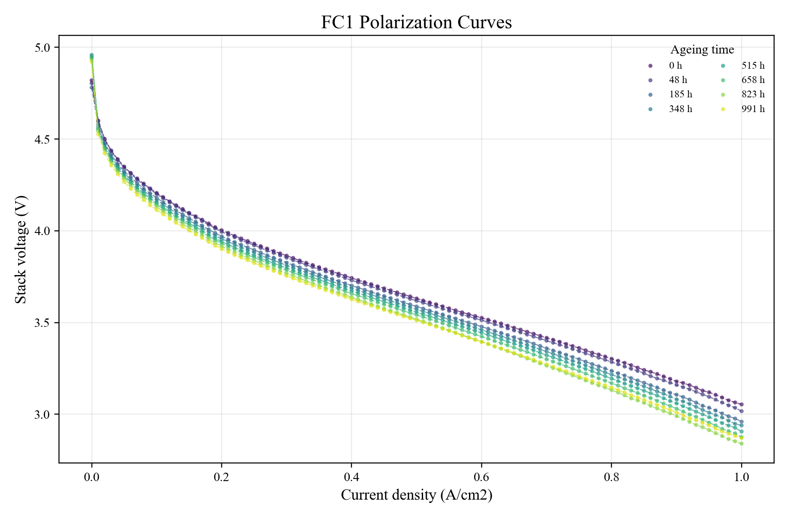
### FC2 polarization curves

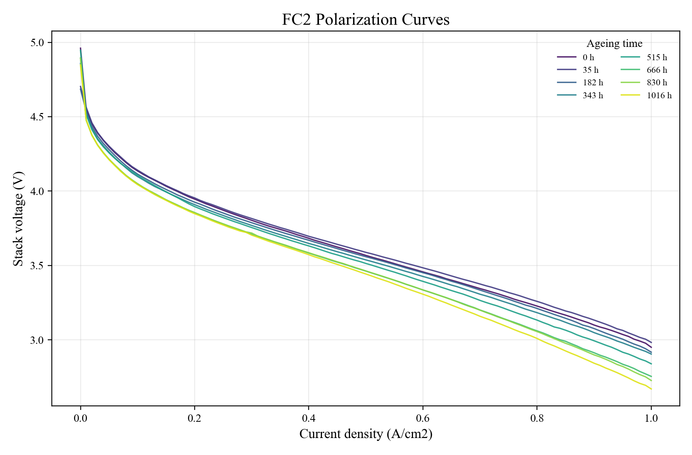

## Individual EIS Figures

### FC1 EIS Nyquist at 20 A

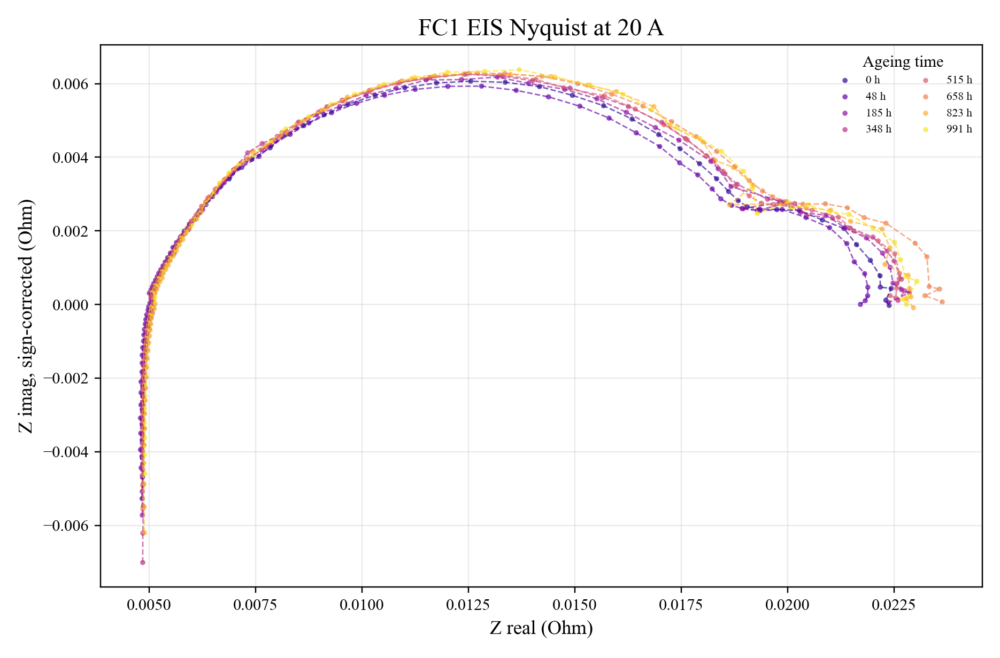
### FC1 EIS Nyquist at 45 A

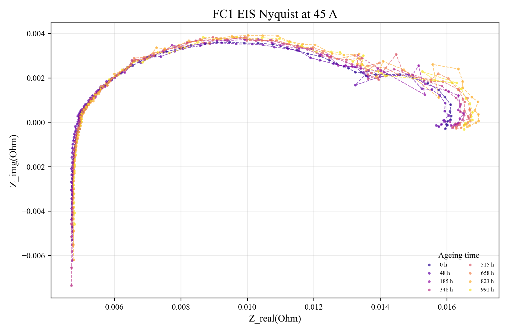
### FC1 EIS Nyquist at 70 A

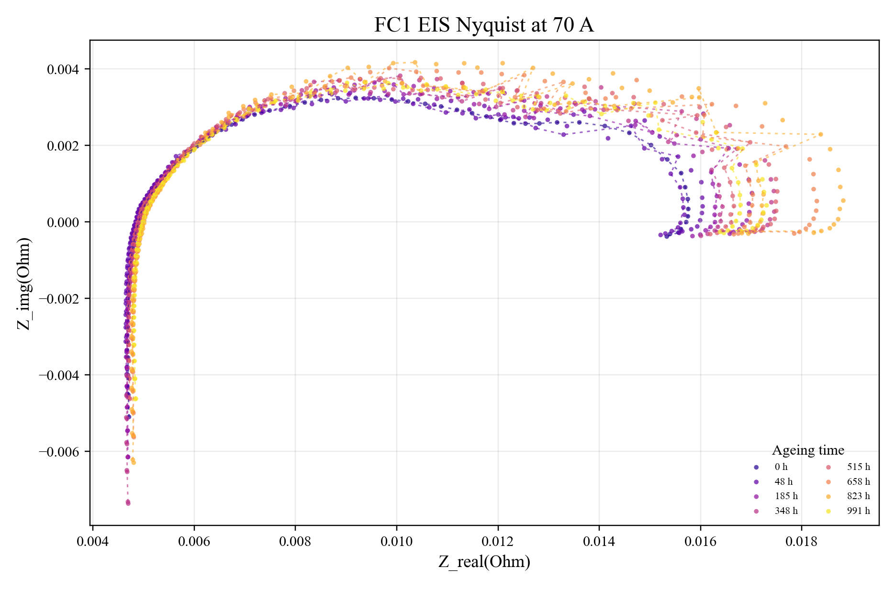
### FC2 EIS Nyquist at 20 A

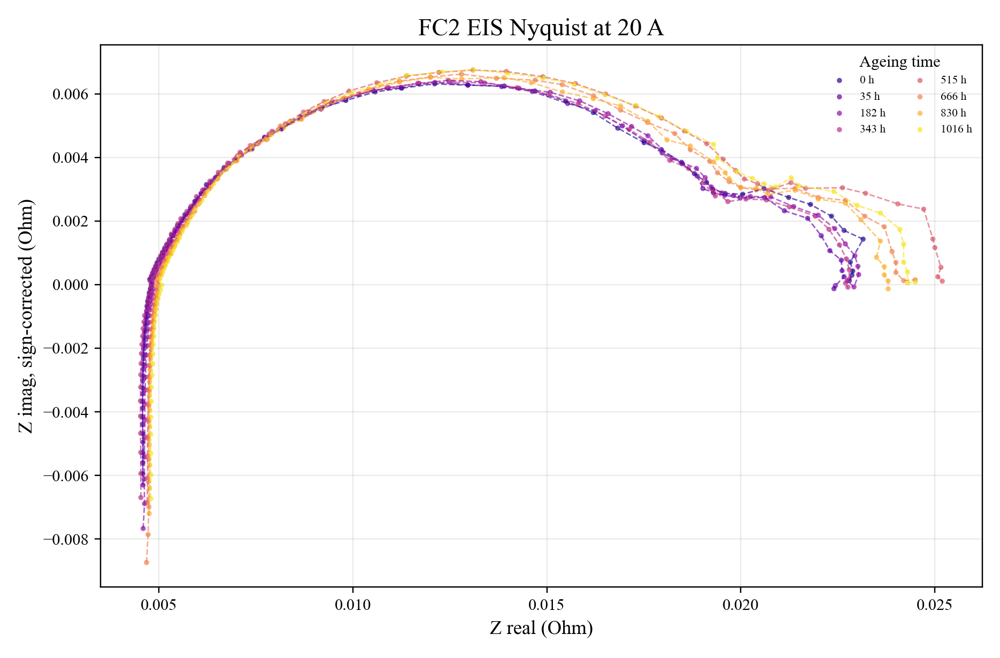
### FC2 EIS Nyquist at 45 A

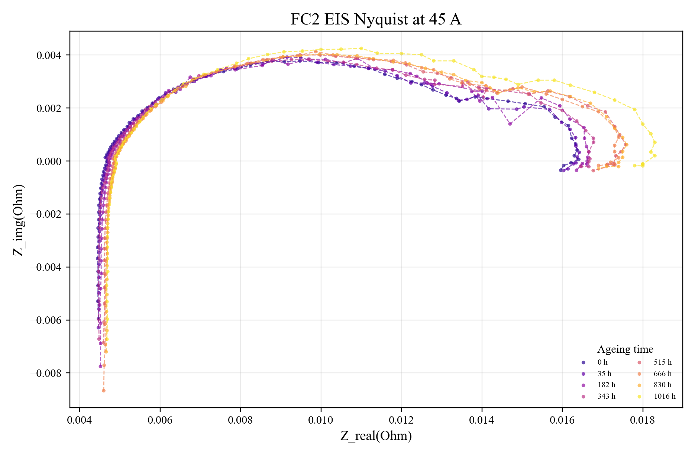
### FC2 EIS Nyquist at 70 A

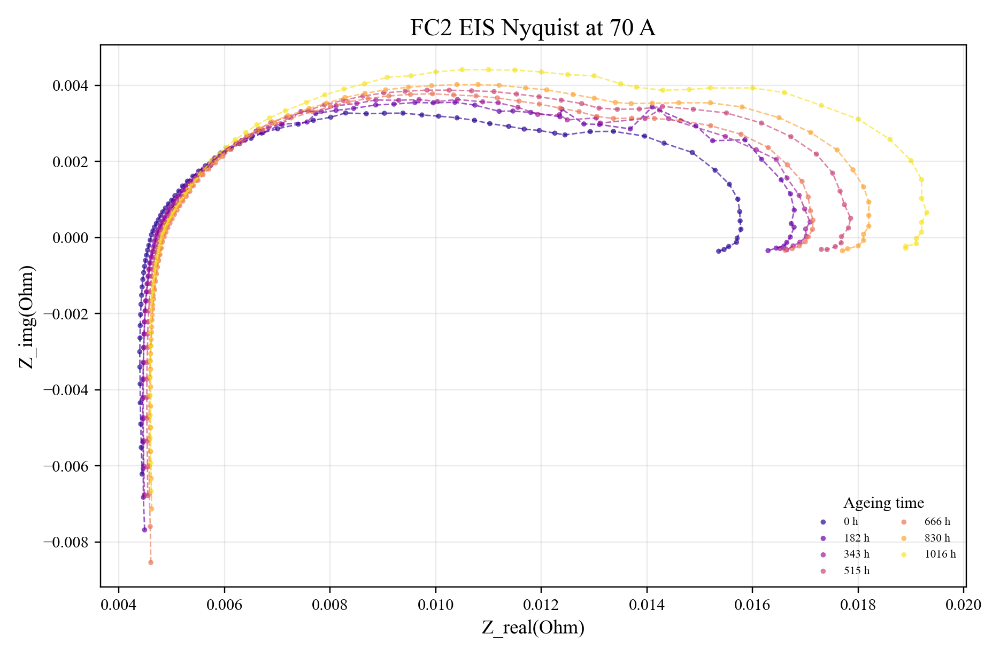

## EIS Resistance Analysis

EIS resistance values were estimated by fitting two least-squares circles to the Nyquist-oriented impedance arc. The split point is selected by scanning candidate boundaries and choosing the two-circle fit with the lowest residual error. `R_ohmic` is taken from the high-frequency real-axis intercept of the first fitted circle. `R_ct_anode` and `R_ct_cathode` are estimated from the real-axis diameters of the first and second fitted circles, respectively.

The full fitted resistance table is saved at `results/eis_resistance_summary.csv`.

### Mean Fitted Resistance by Fuel Cell and EIS Current

| Fuel Cell | Current (A) | R_ohmic (Ohm) | R_ct_anode (Ohm) | R_ct_cathode (Ohm) | R_ct_total (Ohm) |
| --- | --- | --- | --- | --- | --- |
| FC1 | 20 | 0.0051 | 0.0153 | 0.0053 | 0.0206 |
| FC1 | 45 | 0.0049 | 0.0099 | 0.0036 | 0.0135 |
| FC1 | 70 | 0.0049 | 0.01 | 0.0042 | 0.0142 |
| FC2 | 20 | 0.0049 | 0.0161 | 0.0056 | 0.0217 |
| FC2 | 45 | 0.0047 | 0.0106 | 0.0047 | 0.0152 |
| FC2 | 70 | 0.0047 | 0.0108 | 0.0063 | 0.0171 |

### Resistance Trend Figures

#### FC1 Ohmic Resistance

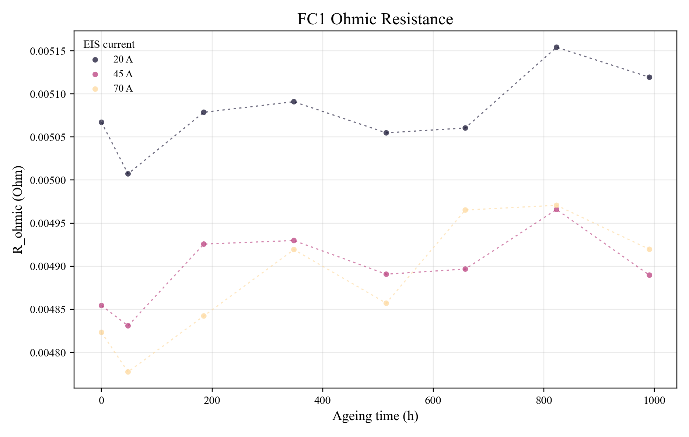
#### FC1 Anode Charge Transfer Resistance

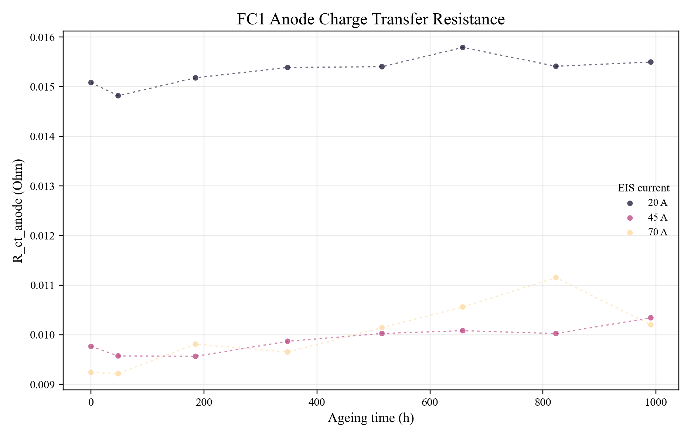
#### FC1 Cathode Charge Transfer Resistance

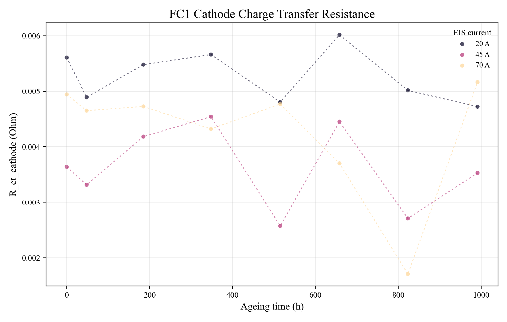
#### FC2 Ohmic Resistance

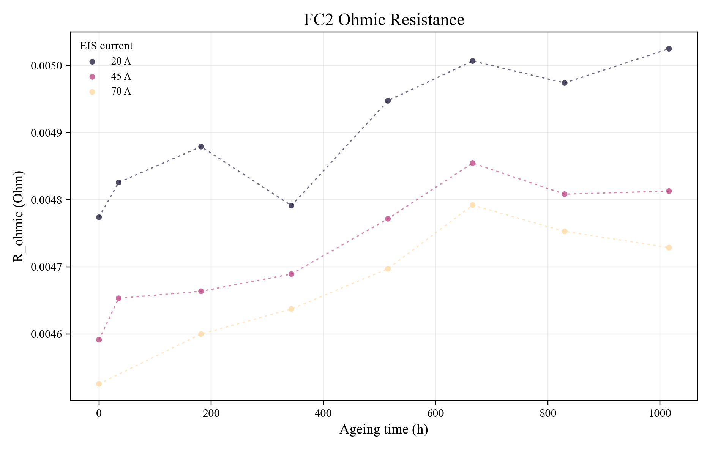
#### FC2 Anode Charge Transfer Resistance

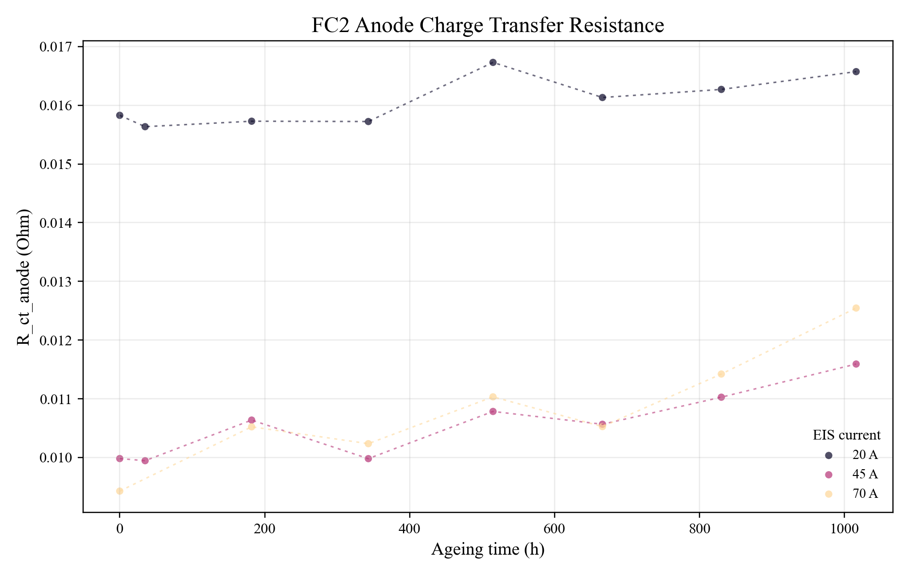
#### FC2 Cathode Charge Transfer Resistance

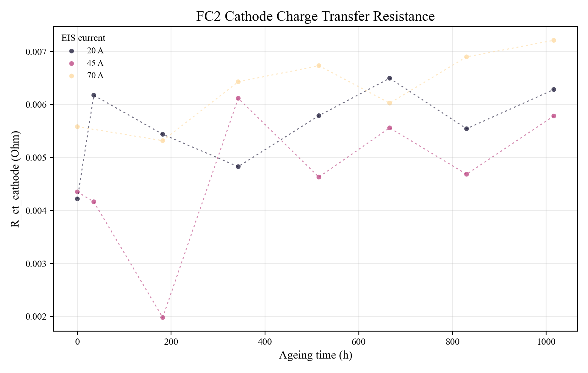
