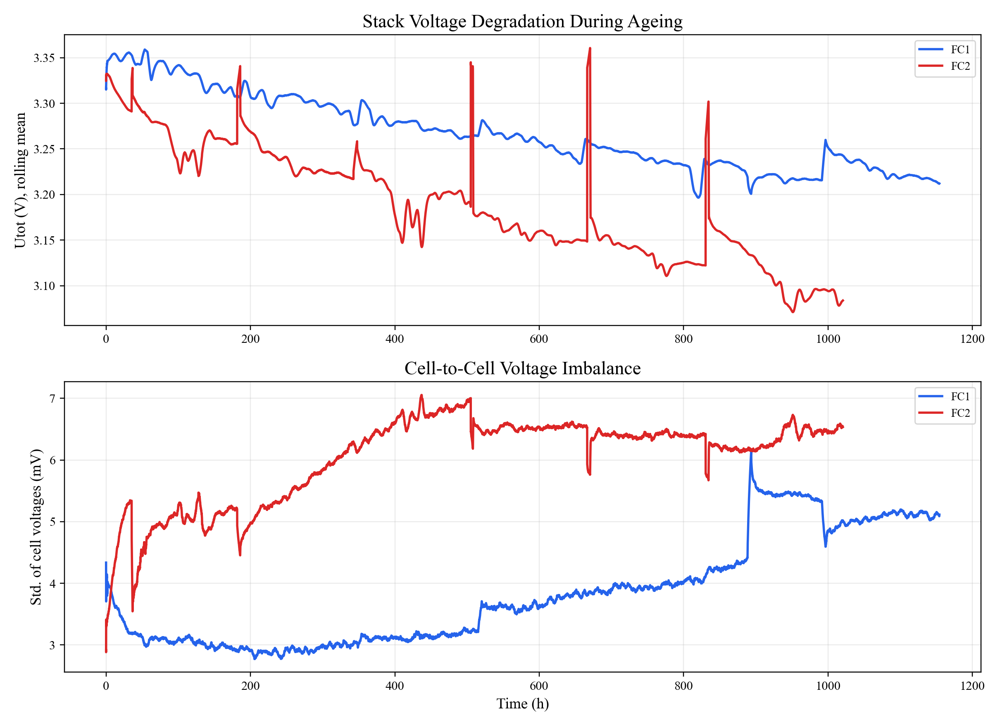

# IEEE PHM Data Challenge 2014

This repository contains the IEEE PHM Data Challenge 2014 fuel-cell durability dataset and a reproducible analysis workflow for quick exploration and visualization.

## Repository Structure

```text
data/     Original dataset files. Do not modify these files.
code/     Reproducible Python analysis scripts.
results/  Generated summaries, figures, and result notes.
```

## Dataset

- **FC1**: fuel-cell durability test operated in a stationary regime
- **FC2**: fuel-cell durability test operated under dynamic current
- **Source**: https://search-data.ubfc.fr/FR-18008901306731-2021-07-19_IEEE-PHM-Data-Challenge-2014.html#pub_col_ver

The dataset includes ageing, polarization, and electrochemical impedance spectroscopy (EIS) measurements.

## Quick Analysis

Run the analysis script from the repository root:

```bash
python code/analyze_fuel_cell.py
```

The script reads the Excel/CSV files under `data/` and writes figures plus summary tables to `results/`.

## Key Results

| Fuel Cell | Duration (h) | Initial Utot (V) | Final Utot (V) | Voltage Drop (V) | Degradation Rate (mV/h) |
| --- | ---: | ---: | ---: | ---: | ---: |
| FC1 | 1154.2 | 3.317 | 3.211 | -0.106 | -0.092 |
| FC2 | 1020.5 | 3.325 | 3.084 | -0.241 | -0.236 |

FC2 shows a larger voltage loss and a faster degradation rate than FC1, consistent with the stronger stress expected from dynamic-current operation.

## Visualizations

### Ageing Voltage Degradation



### Individual Ageing Channels

Individual ageing-channel figures are saved under [`results/figures/ageing_channels/`](results/figures/ageing_channels/). Parameter meanings are summarized in [`results/README.md`](results/README.md).

### Polarization Curve Evolution

Individual polarization figures are saved under [`results/figures/polarization/`](results/figures/polarization/).

### EIS Nyquist Response

Individual EIS figures are saved under [`results/figures/eis/`](results/figures/eis/). The EIS plots use the raw impedance data with the imaginary component sign-flipped for Nyquist-style display.

More result details are summarized in [`results/README.md`](results/README.md).
